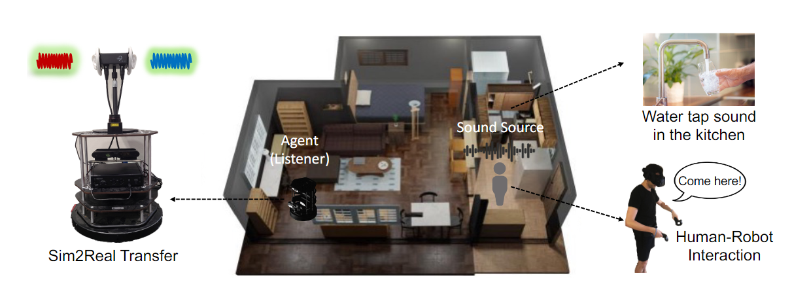

#  SONICVERSE: A Multisensory Simulation Platform for Embodied Household Agents that See and Hear

  

SONICVERSE is a multisensory simulation platform with integrated audio-visual simulation for training household agents that can both see and hear. Built upon [iGibson](https://github.com/StanfordVL/iGibson), SONICVERSE models realistic continuous audio rendering in 3D environments in real-time. Together with a new audio-visual VR interface that allows humans to interact with agents with audio, SONICVERSE enables a series of embodied AI tasks that need audio-visual perception. With these features, we look forward to the embodied multisensory learning research that will be enabled by SONICVERSE.

### Latest Updates
[2/13/2023] We are integrating the audio simulation part to the latest [OmniGibson](https://github.com/StanfordVL/OmniGibson). Updates will be released soon.
[2/11/2023] SONICVERSE released, for details please refer to our [arxiv preprint](https://sites.google.com/view/sonicverse?pli=1). 

<!-- ### Citation
If you use iGibson or its assets and models, consider citing the following publication:

```
@misc{li2021igibson,
      title={iGibson 2.0: Object-Centric Simulation for Robot Learning of Everyday Household Tasks}, 
      author={Chengshu Li and Fei Xia and Roberto Mart\'in-Mart\'in and Michael Lingelbach and Sanjana Srivastava and Bokui Shen and Kent Vainio and Cem Gokmen and Gokul Dharan and Tanish Jain and Andrey Kurenkov and Karen Liu and Hyowon Gweon and Jiajun Wu and Li Fei-Fei and Silvio Savarese},
      year={2021},
      eprint={2108.03272},
      archivePrefix={arXiv},
      primaryClass={cs.RO}
}
``` -->
### Documentation
SONICVERSE is built upon iGibson and Resonance audio. Please first follow the documentation of iGibson to setup the environment first and then setup the Resonance audio.

The documentation for iGibson can be found here: [iGibson Documentation](http://svl.stanford.edu/igibson/docs/). It includes installation guide (including data download instructions), quickstart guide, code examples, and APIs.

The audio simulation of SONICVERSE is built upon [Resonance audio](https://resonance-audio.github.io/resonance-audio/). To install Resonance audio, please follow the steps below:

#### Core Dependencies ([pffft](https://bitbucket.org/jpommier/pffft), [eigen](https://bitbucket.org/eigen/eigen), [googletest](https://github.com/google/googletest), [SADIE Binaural Measurements](https://www.york.ac.uk/sadie-project/database_old.html))

To clone the dependencies into the repository, run:

    ./$YOUR_LOCAL_REPO/resonance_audio/third_party/clone_core_deps.sh

#### [Unity](https://unity3d.com/) Platform Dependencies ([nativeaudioplugins](https://github.com/Unity-Technologies/NativeAudioPlugins), [embree](https://github.com/embree/embree), [ogg](https://github.com/xiph/ogg), [vorbis](https://github.com/xiph/vorbis))

The Unity plugin integrates additional tools to estimate reverberation from game
geometry and to capture Ambisonic soundfields from a game scene. These features
require the Embree, libOgg and libVorbis libraries to be *prebuilt*.

To clone and build the additional Unity dependencies, run:

    ./$YOUR_LOCAL_REPO/resonance_audio/third_party/clone_build_install_unity_deps.sh

#### Build Resonance Audio API
To build the Resonance Audio into iGibson:

    ./$YOUR_LOCAL_REPO/resonance_audio/build.sh -t=RESONANCE_AUDIO_API

#### Build Resonance Audio IGibson Plugin
To build the Resonance Audio into iGibson:

    ./$YOUR_LOCAL_REPO/resonance_audio/build.sh -t=IGIBSON_PLUGIN

### Dowloading the Dataset of 3D Scenes

For instructions to download dataset, you can visit [installation guide](http://svl.stanford.edu/igibson/docs/installation.html) and [dataset download guide](http://svl.stanford.edu/igibson/docs/dataset.html).

For audio dataset, we use the sounds collected by [Soundspace dataset](https://github.com/facebookresearch/sound-spaces/blob/main/soundspaces/README.md). Please follow the instructions to download the dataset.

### Usage

For usage, please refer to the example files in Sonicverse/Sonicverse/igibson/examples/audio_system. We have tested the simulator on Linux/Windows with an Nvidia GPU with VRAM > 6.0 GB. All the experiments are conducted with a rendering frame rate of 10 Hz and an audio sampling rate of 48000 Hz. Other configuration may also work.

### Contributing
This is the github repository for SONICVERSE release. Bug reports, suggestions for improvement, as well as community developments are encouraged and appreciated. Please, consider creating an issue or sending us an email. 
