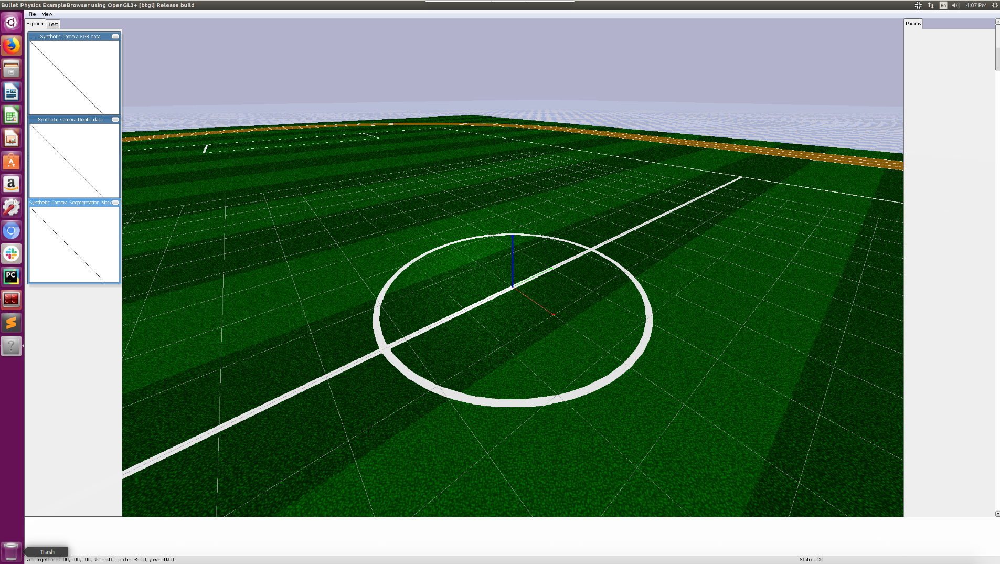

# Scenes

### Overview
We provide four types of scenes.
- `EmptyScene` and `StadiumScene`: they are simple scenes with flat grounds and no obstacles, useful for debugging purposes.
- `StaticIndoorScene`: it loads static 3D scenes from `igibson.g_dataset_path`.
- `InteractiveIndoorScene`: it loads fully interactive 3D scenes from `igibson.ig_dataset_path`.

Typically, they take in the `scene_id` of a scene and provide a `load` function that be invoked externally (usually by `import_scene` of the `Simulator`).

To be more specific, the `load` function of `StaticIndoorScene`
- stores the floor information (we have many multistory houses in our dataset)
- loads the scene mesh into PyBullet
- builds an internal traversability graph for each floor based on the traversability maps stored in the scene folder (e.g. `dataset/Rs/floor_trav_0.png`)
- provides APIs for sampling a random location in the scene, and for computing the shortest path between two locations in the scene.

In addition to everything mentioned above, the `load` function of `InteractiveIndoorScene` also
- provides material/texture randomization functionality: randomize the material, texture and dynamic property of scene object models
- provides object randomization functionality: randomize scene object models while keeping object poses and categories intact
- provides scene quality check: check if object models have collisions and if fixed, articulated objects can extend their joints fully without collision
- provides partial scene loading functionality: 1) only load objects of certain categories, 2) only load objects in certain room types, 3) only load objects in certain room instances.
- provides APIs for changing the state of articulated objects (e.g. open all "fridges" and "ovens" in the scene)

Most of the code can be found here: [igibson/scenes](https://github.com/StanfordVL/iGibson/blob/master/igibson/scenes).

### Adding other scenes to iGibson
We provide detailed instructions and scripts to import scenes from the following sources into iGibson:
1. [CubiCasa5k](https://github.com/CubiCasa/CubiCasa5k): A Dataset and an Improved Multi-Task Model for Floorplan Image Analysis. (Kalervo, Ahti, et al.)
2. [3D-FRONT](https://tianchi.aliyun.com/specials/promotion/alibaba-3d-scene-dataset): 3D Furnished Rooms with layOuts and semaNTics. (Fu, Huanl, et al.)

Instruction can be found here: [External Scenes](https://github.com/StanfordVL/iGibson/blob/master/igibson/utils/data_utils/ext_scene). 


### Examples

#### Stadium Scenes

In this example, we import a simple stadium scene that is good for debugging. The code can be found here: [igibson/examples/scenes/stadium_example.py](https://github.com/StanfordVL/iGibson/blob/master/igibson/examples/scenes/stadium_example.py).

```{literalinclude} ../igibson/examples/scenes/stadium_example.py
:language: python
```

The stadium scene looks like this:


#### Static Building Scenes

In this example, we import a static scene, and then randomly sample a pair of locations in the scene and compute the shortest path between them. The code can be found here: [igibson/examples/scenes/g_scene_selector.py](https://github.com/StanfordVL/iGibson/blob/master/igibson/examples/scenes/g_scene_selector.py).

```{literalinclude} ../igibson/examples/scenes/g_scene_selector.py
:language: python
```


#### Interactive Building Scenes
In this example, we import a fully interactive scene, and randomly sample points given a room type such as "living_room". This can be useful for tasks that require the robot to always be spawned in certain room types. We support fifteen such scenes right now as part of the new iGibson Dataset. The code can be found here: [igibson/examples/scenes/ig_scene_selector.py](https://github.com/StanfordVL/iGibson/blob/master/igibson/examples/scenes/ig_scene_selector.py).

Note that all objects in these scenes can be interacted realistically.


```{literalinclude} ../igibson/examples/scenes/ig_scene_selector.py
:language: python
```

##### Texture Randomization
In this example, we demonstrate material/texture randomization functionality of `InteractiveIndoorScene`. The goal is to randomize the material, texture and dynamic properties of all scene objects by calling `scene.randomize_texture` on-demand. The code can be found here: [igibson/examples/scenes/scene_texture_rand_example.py](https://github.com/StanfordVL/iGibson/blob/master/igibson/examples/scenes/scene_texture_rand_example.py ).

The randomized materials in the `ExternalView` window should look like this.


##### Object Randomization
In this example, we demonstrate object randomization functionality of `InteractiveIndoorScene`. The goal is to randomize the object models while maintaining their poses and categories. Note that when object models are randomized, there is no guarantee that they have no collisions or the fixed, articulated objects can extend their joints without collision. We provide `scene.check_scene_quality` functionality to check scene quality and you should do object model re-sampling if this function returns `False`. An alternative way (recommended) is to use randoml object model configuration that we provide (10 for each scenes) which guarantees scene quality, by passing in `object_randomization_idx=[0-9]`. Finally, object randomization can be expensive because the new object models need to be loaded to the simulator each time, so we recommend only using it occasionally (e.g. every 1000 training episodes). The code can be found here: [igibson/examples/scenes/scene_texture_rand_example.py](https://github.com/StanfordVL/iGibson/blob/master/igibson/examples/scenes/scene_texture_rand_example.py).

The randomized object models in the `ExternalView` window should look like this.


##### Partial Scene Loading
In this example, we demonstrate partial scene loading functionality of `InteractiveIndoorScene`. Specifically in this example we only load "chairs" in "living rooms". This can be useful for tasks that only require certain object categories or rooms. The code can be found here: [igibson/examples/scenes/scene_partial_loading_example.py](https://github.com/StanfordVL/iGibson/blob/master/igibson/examples/scenes/scene_partial_loading_example.py).

#### Visualize Traversability Map

In this example, we visuliaze the traversability map of a scene. We use this map to build an internal traversability graph for each floor so that we can compute the shortest path between two locations, and place robots and objects at valid locations inside the scene. The code can be found here: [igibson/examples/robots/trav_map_vis_example.py](https://github.com/StanfordVL/iGibson/blob/master/igibson/examples/robots/trav_map_vis_example.py).

The traversability map of the scene `Rs` looks like this:


